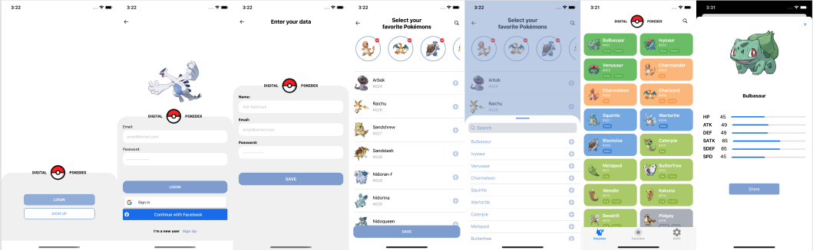
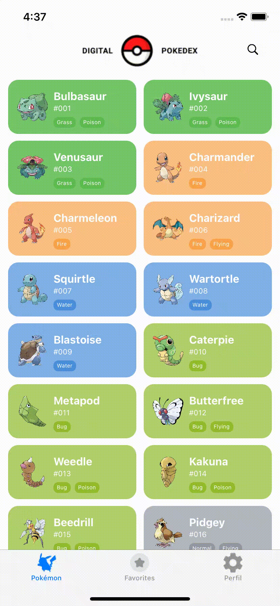

<p align="center">
  
</p>
 <br> <br>

---
---

 <br> <br>

 <br> <br>
## Informações ##

Quando crianças, muitos de nós, jogamos Pokémon e assistimos o anime na TV e em cada etapa de jogo e capítulo do anime fomos conhecendo mais sobre aquele mundo e seus habitantes, os incríveis Pokémon.

No mundo Pokémon, devemos encarar uma jornada com vários objetivos. Um dos mais importantes é derrotar a Equipe Rocket e impedir que eles capturem e usem os Pokémon para dominar o mundo. Para conhecer melhor os monstrinhos e selecionar quais nos ajudarão a derrotar esta equipe, nos jogos, possuímos uma Pokedéx (ou PokeAgenda) que nos mostra detalhes de cada um mas, infelizmente, ela é um pouco incompleta. 

Pensando nisso, resolvemos criar o aplicativo Digital Pokedéx. Um aplicativo que ajudará os jogadores que desejarem encarar esta jornada.

Este projeto foi desenvolvido durante o Santander Coders Mobile 2020 no curso Desenvolvimento Mobile iOS em parceria com a [DigitalHouse](https://www.digitalhouse.com/br).

 <br> <br>

---
---
 <br> <br>
<p align="center">
  
</p>

## Funcionalidades ##

O aplicativo lista todos os Pokémon disponíveis, seus tipos e atributos. 

Nele, também, podemos selecionar nossos  monstrinhos favoritos e compartilhar informações nas redes sociais.

Para coletar os dados de cada Pokémon, utilizamos a [PokeAPI](https://pokeapi.co/). Ela é gratuita e aberta e contém vários dados sobre os monstrinhos.

 <br> <br>

---
---

<br> <br>
<p align="center">
  
</p>

## Criação do Design ##
* Inicialmente, desenvolvemos o protótipo do App no [Figma](https://www.figma.com/file/cPY3FRePc22Olj2r6bEGXn/DigitalPokedex?node-id=25%3A321)
<br> <br>

---
---

<br> <br>
## Preview ##
<div align="center">

Login | Cadastro
---|---
 |  


<br>
<br>
<br>

Detalhes | Logout
---|---
 |  

</div>


<br> <br>

---
---

<br> <br>
<p align="center">
  
</p>


## Como executar a aplicação: ##
* OBS: Para executar esta aplicação você deve ter o Xcode configurado em um computador com Sistema MacOS:
	* Baixe o Xcode através deste [link](https://developer.apple.com/xcode/)


### Passo 1: Clonar o repositório: ###

```
$ git clone https://github.com/DigitalPokedex/IOS_DIgitalHouse_ProjetoIntegrador

$ cd IOS_DIgitalHouse_ProjetoIntegrador
```

### Passo 2: Instalar pods ###

```
$ pod install
```
### Passo 3: Rodar o projeto ###
```
Abrir o projeto no Xcode e executar a aplicação.
```


<br> <br>

---
---

<br> <br>

## Fale conosco: ##

<div style="display: flex;flex-direction: column;">
  <div style="align-self: center;display: flex;flex-direction: row; justify-content: space-between; align-items: center; width: 250px;margin-top: 50px;margin-bottom: 50px">
  <div align="center">
  <a href="https://github.com/cetava">
  
  <br />
    <p>
  <sub><b>César Tavares</b></sub></a>
  <p>
  </div>

  <div align="center">
  <a href="https://github.com/joorgeroberto">
  
  <br />
    <p>
  <sub><b>Jorge de Carvalho</b></sub></a>
  <p>
  </div>
  </div>
<div align="center">

  [](https://www.linkedin.com/in/cesar-aparecido-tavares-0166951b8/)
  [](https://github.com/cetava)
  [](mailto:cetava@gmail.com)

  [](https://www.linkedin.com/in/jorge-de-carvalho-aa21b2186/)
  [](https://github.com/joorgeroberto)
  [](mailto:jorgercjo@dcomp.ufs.br)
  </div>
</div>


<br> <br>

---
---

<br> <br>

<p align="center">
  
</p>

## Aceitamos sugestões para melhorar o nosso projeto :)

**Qualquer dificuldade na instalação do Xcode ou na execução do projeto, estamos a disposição nos emails: cetava@gmail.com e joorgercj@dcomp.ufs.br**